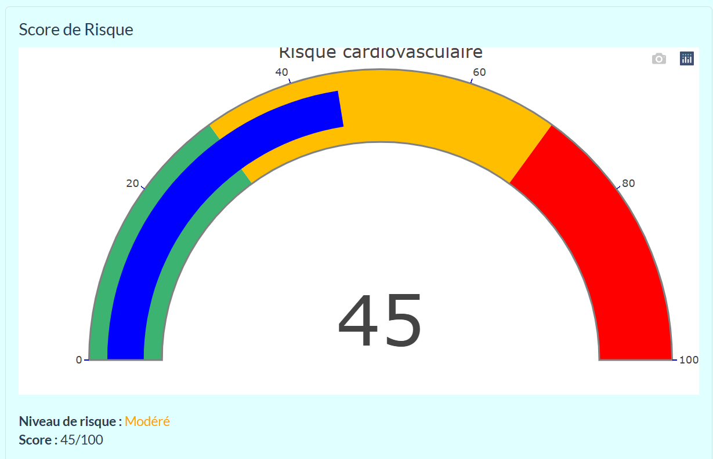
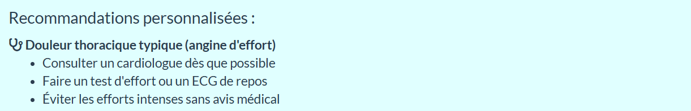

Noms des participants :

-   **KOFFI** Kouamé Jean-Baptiste

-   **KOUASSI** Kouadio Prosper

Lien vers l'application : <https://jblalegende17.shinyapps.io/projet2025_JB_la_legende/>

# **CardioVision : l'IA au service du Coeur**

## 1. Introduction

Les maladies cardiovasculaires constituent l'une des principales causes de mortalité dans le monde, représentant près de **18 millions** de décès chaque année selon l’OMS. La détection précoce des facteurs de risque est donc cruciale pour prévenir ces pathologies. Dans ce contexte, nous avons conçu une application interactive, **CardioVision**, qui utilise des outils de visualisation de données et des modèles prédictifs pour aider à comprendre et anticiper les risques cardiaques.

**Attention :** cette application a une visée pédagogique et exploratoire. Elle ne remplace en aucun cas un diagnostic médical ou un avis professionnel de santé.

## 2. Données utilisées

### 2.1. Données cliniques

Nous avons utilisé un jeu de données médicales réelles contenant des informations sur 303 patients. Les informations recueillies sur les patients se divisent en deux groupes :

-   **Facteurs mesurables** : âge, pression artérielle au repos, taux de cholestérol, fréquence cardiaque maximale atteinte, dépression du segment ST, nombres de vaisseaux sanguins colorés par fluoroscopie.

-   **Facteurs non mesurables** : sexe, type de douleur thoracique, électrocardiogramme, type de glycémie à jeun, type de résultats de l'ECG au repos, angine induite par exercice, type de pente du segment ST de l'ECG, thalassémie.

La variable cible nommée **output**, indique si le patient est sujet à une attaque cardiaque ou non.

### 2.2. Données géographiques

Pour la cartographie, nous avons utilisé des donnés provenant de l'OWID (Our World in Data), accessibles via le lien <https://ourworldindata.org/cardiovascular-diseases?utm_source=chatgpt.com#all-charts>.

## 3. Architecture de l'application

L’application est structurée en quatres fichiers repartis comme suit :

-   **global.R** : pour le chargement des données et des bibliothèques

-   **ui.R** : l'interface utilisateur pour afficher les sorties

-   **server.R** : pour le traitementet le calcul des sorties

-   **app.R** : assure la liaison entre glabal.R, ui.R et server.R

## 4. Fonctionnalités principales

### 4.1. Cartographie

Dans l'onglet Cartographie on peut visualiser interactivement une carte mondiale des décès cardiovasculaires avec des données fournies par l'OWID. Cette visualisation peut être filtrée par année, de 2000 à 2021.

### 4.2. Exploration

Cette fonctionnalité se retrouve dans l'onglet *Explorer* contenant deux éléments dans sa liste déroulante : *DataBase* et *Visualisation des Données*. Dans le sous-onglet *DataBase*, on peut explorer dynamiquement la table des données qui nous ont servies de support pour l'étude. Le sous-onglet *Visualisation des Données* quant à lui, contient des graphiques qui permettent de constater le comportement de chaque facteur (mesurable ou non mesurable) sur le risque d'attaque cardiaque. Pour visualiser le graphique d'un facteur, il suffit de le sélectionner dans la liste déroulante à gauche du graphique.

### 4.3. Comprendre

Dans le cadre de notre travail de data scientists, nous avons développé et comparé méthodiquement plusieurs modèles prédictifs du risque cardiaque. Notre démarche a consisté à :

1.  Construire différents modèles: logistique ( Sélection de variables (stepAIC) et plusieurs autres modèles) et Random Forest.

2.  Comparer rigoureusement leurs performances à travers des critères statistiques (AIC/BIC, erreur en validation croisée K-fold, tests ANOVA pour les modèles emboîtés).

3.  Optimiser systématiquement chaque modèle pour en maximiser la pertinence clinique et la puissance prédictive.

Cette approche scientifique nous a permis d'identifier et de retenir les deux modèles les plus performants et complémentaires pour notre analyse, combinant à la fois précision mathématique et interprétabilité médicale :

**Le modèle complet** : construis avec toutes les variables explicatives y compris les transformations sur d'autres.

**Le modèle réduit**: obtenu à partir du critère Anova (critère permettant de sélectionner les variables explicatives les plus pertinentes).

Une fois l'analyse terminée, les critères suivants (relatifs à la performance du modèle) sont renvoyès :

-   **Exactitude** : mesure le pourcentage total de prédictions correctes parmi toutes les observations.

-   **AUC** : mesure la capacité du modèle à séparer les malades des non malades.

-   **Sensibilité** : mesure la capacité du modèle à détecter correctement les malades parmi les patients qui sont déjà déclarés malades.

-   **Spécificité** : mesure la capacité du modèle à détecter correctement les sains parmi les patients qui sont déjà déclarés sains.

Cette étape s'accompagne de l'analyse des variables importantes. A ce niveau, les critères analysés sont :

-   **Coefficient** : indique l'effet de la variable sur le log odds (logarithme du risque relatif).

-   **Ratio de cotes (odds ratio)** : exponentielle du Coefficient. Un odds ratio \> 1 = augmentation du risque.

-   **p-value** : mesure la probabilité que l'effet observé soit dû au hasard. Une p-value \< 0,05 = significativité.

-   **Significativité** : mesure la significativité de la variable. Les différents seuils de significativité ici sont :

    -   **\* : p-value \< 0,05**

    -   **\*\* : p-value \< 0,01**

    -   **\*\*\* : p-value \< 0,001**

### 4.4. Prévenir

Cette fonctionnalité permet de prévenir une *potentielle* attaque cardiaque. A l'aide d'un formulaire patient interactif, vous pouvez dans un premier temps choisir le modèle (Modèle Complet ou Modèle Simplifié) que vous désirez utiliser pour la prédiction. Une fois le modèle choisi, vous pouvez ensuite renseigner des informations telles que l'âge, le sexe, le type de douleur thoracique, la pression artérielle au repos, le nombre de vaisseaux coronaires obstrués et si le patient fume ou pas.

Quand toutes ces étapes sont réalisées, le bouton **Estimer le Risque** vous permet d'obtenir un retour visuel du score, sur 100, du *potentiel* risque d'attaque cardiaque. Ce score est accompagné de recommandations personnalisées qui ont pour but de prévenir l'attaque cardiaque. Ci-dessous, quelques images illustratives de cette fonctionnalité :

-   Score du risque :

{width="543"}

-   Recommandations personnalisées :

## 5. Améliorations futures

Les futures améliorations futures pourraient inclure :

-   L'intégration de nouveaux modèles de régression tels que les forêts d'arbres ou la ADL (Analyse Discriminante Linéaire).

-   Le développement d'une version mobile de l'application.

-   L'utilisation de plus de données médicales et actualisées.

-   Une étroite collaboration avec des professionnels de la santé.

## 6. Conclusion

**CardioVision** est une application Shiny intuitive et interactive qui permet à la fois d’explorer les données médicales, de mieux comprendre les facteurs de risque cardiovasculaire et de prédire la présence potentielle de maladie. Elle combine science, visualisation et accessibilité dans un objectif préventif et éducatif.
